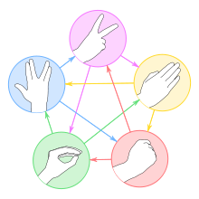

# Rock-Paper-Scissors by Mario Lupo Ciaponi
This is a mini project. It is a simple game of Rock-Paper-Scissors which we all played as kids.
Updates to the game will come.

## Rules:
- Rock beats Scissors
- Paper beats Rock
- Scissors beat Paper

## Purpose of this project:
The purpose of this project is to practice my Git and GitHub skills. This game is known to all of us(and probably made
a lot of times) so it is not something special, just a mini project :). I will implement some unique features so the experience
will be more interesting.

## Source code;
[Source code](https://github.com/Mario-Lupo-Ciaponi/RockPaperScissorsByMarioLupoCiaponi/blob/main/rock_paper_scissors.py).
If you encounter any bugs in my code please let me know and I will fixe them.