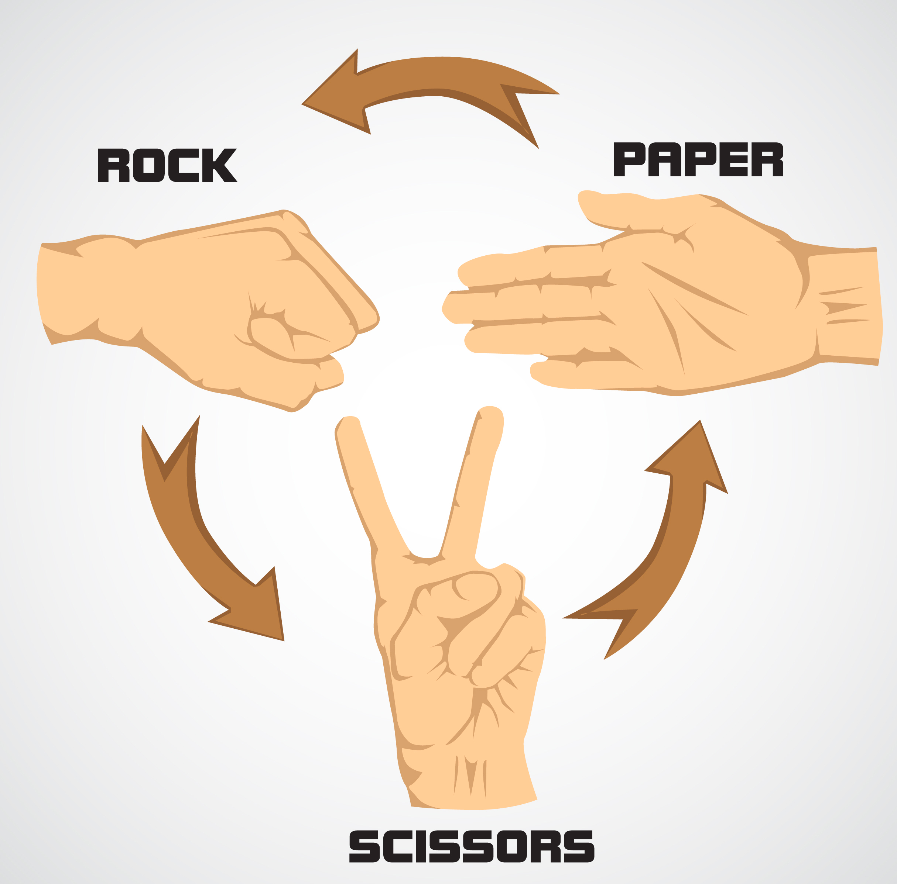

# Rock-Paper-Scissors by Mario Lupo Ciaponi
This is a mini project. It is a simple game of Rock-Paper-Scissors which we all played as kids. 

## Rules:
- Rock beats Scissors
- Paper beats Rock
- Scissors beats Paper

## Purpose of this project:
The purpose of this project is to practice my Git and GitHub skills. This game is known to all of us(and probably made
a lot of times) so it is not something special, just a mini project :). I will implement some unique features so the experience
will be more interesting.

